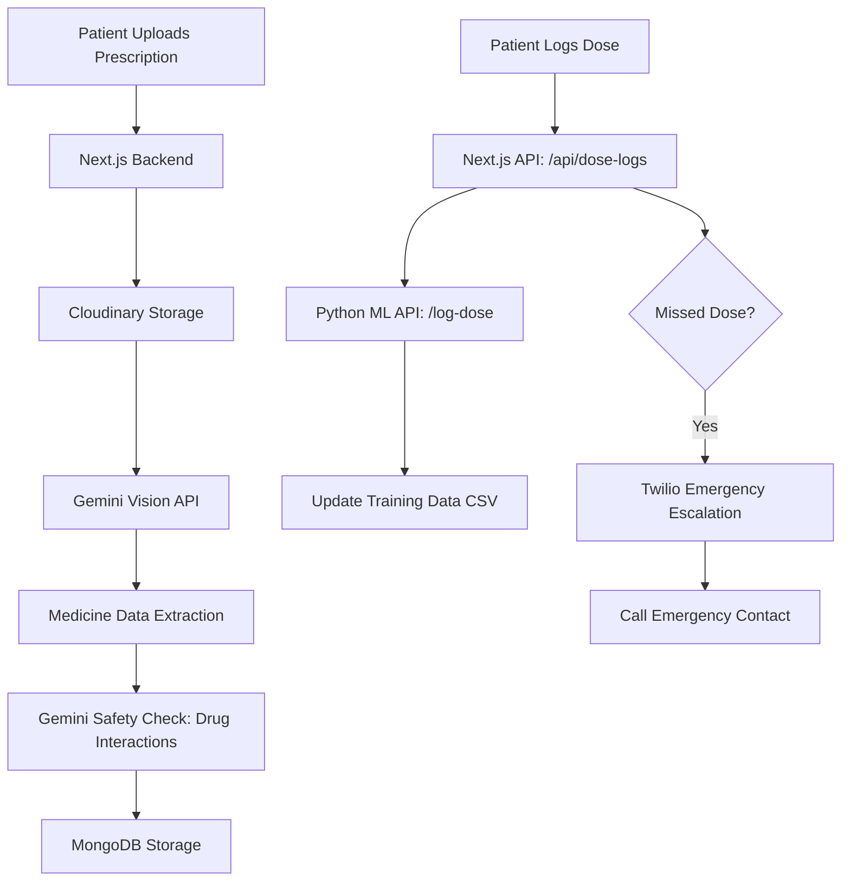

# MediSaathi Backend Implementation Plan 🏥 (Final Version)

This document provides a comprehensive step-by-step guide to the backend logic, architecture, and setup for the MediSaathi platform.

---

## 1. System Overview 🏗️
MediSaathi uses a **Micro-service/Hybrid architecture**:
- **Next.js (Node.js)**: Handles User Auth, Database (MongoDB), Image Uploads (Cloudinary), and Gemini AI Orchestration.
- **Python FastAPI**: Handles Machine Learning tasks (Dose Adherence Prediction, Risk Scoring).
- **Twilio**: Handles automated Emergency Voice Escalation.

### Architecture Flow:


---

## 2. Full Backend Flow Logic 🔄

### A. AI Prescription Scanner (Gemini Vision)
- **File:** `api/prescriptions`
- **Logic:** Receives an image, uploads to Cloudinary, then sends the URL to **Gemini 1.5 Flash** with a specialized medical prompt.
- **Output:** Structured JSON with medicine names, dosages, and schedules.

### B. Drug Interaction Guardrail
- **File:** `api/prescriptions/add-medications`
- **Logic:** When adding new medicines, the backend fetches the patient's existing medication list. It sends both lists to Gemini to check for **Drug-Drug Interactions (DDI)**.
- **Result:** Alerts the user if a new medicine is dangerous when combined with their current ones.

### C. Adherence ML Training Sync
- **File:** `api/dose-logs`
- **Logic:** Every time a user marks a dose (Taken/Missed/Skipped), the data is forwarded to the Python ML API.
- **Impact:** This builds a real-time dataset (`training_data.csv`) that the ML model uses to predict future risks.

### D. Emergency Escalation (Twilio)
- **File:** `api/escalation`
- **Logic:** If a critical dose is missed, the system fetches the **Primary Emergency Contact** from the user profile.
- **Action:** Triggers an automated AI voice call via Twilio to alert the caregiver.

---

## 3. Implementation Steps (Step-by-Step) 🛠️

### Step 1: Secure FREE API Keys 🔑
Register for these free accounts:
1.  **Google Gemini AI**: [AI Studio](https://aistudio.google.com/app/apikey) (Free) — *For OCR & Logic*.
2.  **Cloudinary**: [Cloudinary.com](https://cloudinary.com/) (Free) — *For image storage*.
3.  **Twilio**: [Twilio Console](https://www.twilio.com/) (Trial) — *For emergency calls*.
4.  **MongoDB Atlas**: [MongoDB.com](https://www.mongodb.com/) (Free Cluster) — *For database*.

### Step 2: Configure Environment `.env.local` ⚙️
Ensure these are in your root `.env.local` (and `apps/web/.env.local`):
```bash
# Database
MONGODB_URI="your_mongodb_uri"

# AI & Media
GEMINI_API_KEY="your_gemini_key"
CLOUDINARY_CLOUD_NAME="your_cloud_name"
CLOUDINARY_API_KEY="your_api_key"
CLOUDINARY_API_SECRET="your_api_secret"

# ML Communication
ML_API_URL="http://localhost:8000"
ML_API_SECRET="local-dev-secret-key"

# Emergency Calls (Twilio)
TWILIO_ACCOUNT_SID="your_sid"
TWILIO_AUTH_TOKEN="your_token"
TWILIO_PHONE_NUMBER="your_twilio_number"
```

### Step 3: Run the Servers 🚀
You need two terminals open:

**Terminal 1: Next.js (Web & API)**
```bash
cd apps/web
npm install
npm run dev
```

**Terminal 2: Python (ML API)**
```bash
cd apps/ml-api
python -m venv venv
.\venv\Scripts\activate
pip install -r requirements.txt
uvicorn main:app --reload
```

---

## 4. Testing the Backend 🧪
1.  **Seed Data**: Run `node src/seed/seed.js` inside `apps/web` to create a test user "Sunita Devi" with emergency contacts.
2.  **Scan**: Upload a prescription image.
3.  **Log Dose**: Mark a dose as "Missed" and check console/Twilio logs for escalation.
4.  **Check ML**: Verify `apps/ml-api/data/training_data.csv` is updated.

---
**MediSaathi** — Building a safer, AI-first healthcare experience for our elders. 👵❤️
